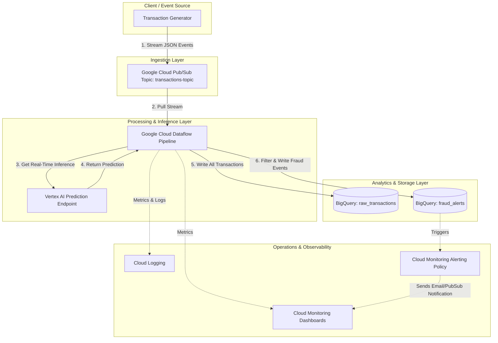

# Real-Time Fraud Detection Streaming Platform on GCP

A production-grade, portfolio-grade streaming machine learning pipeline built on Google Cloud Platform (GCP). This project demonstrates **Professional Machine Learning Engineer (PMLE)** and **Cloud Data Engineer** competencies, including real-time ingestion, stateful feature engineering, online model inference with fallback capabilities, and infrastructure-as-code (IaC).

---

## 1. System Architecture & Data Flow

The system processes transaction events in real time as they occur. The data flow moves from ingestion to stream processing, feature engineering, real-time ML model inference, storage, and alerting.



Detailed architectural tradeoffs, advantages, and MLOps decisions are documented in [docs/architecture.md](file:///e:/Fraud_Detection_Streaming_Platform/docs/architecture.md).

---

## 2. Directory Layout

```text
.
├── README.md                         # Main project documentation & runbook
├── docs/                             # Architecture and requirement specifications
│   ├── architecture.md               # Deep dive into GCP components & MLOps decisions
│   └── requirements.md               # Functional, non-functional, security constraints
├── schemas/                          # Data governance schemas
│   └── transaction_event.json        # JSON Schema for incoming transactions
├── terraform/                        # Infrastructure as Code
│   ├── backend.tf                    # GCS Remote State configuration
│   ├── main.tf                       # Pub/Sub, BigQuery tables, GCS buckets
│   ├── alerts.tf                     # Alert policies, notification channels, dashboards
│   ├── variables.tf                  # Parameter variables (default Project ID: fraud-prediction-499405)
│   └── outputs.tf                    # Exposes resource names dynamically
├── generator/                        # Client Ingestion Simulator
│   ├── generator.py                  # Python script simulating transaction profiles
│   ├── requirements.txt              # Client library dependencies
│   └── Dockerfile                    # Containerization for generator deployment
├── dataflow/                         # Apache Beam processing pipeline
│   ├── pipeline.py                   # Streaming pipeline code (Stateful + Inference)
│   ├── test_pipeline.py              # In-memory Unit Test Suite (8 tests)
│   ├── requirements.txt              # Runner-level dependencies
│   └── setup.py                      # Worker distribution script
└── vertex_ai/                        # ML Model training
    ├── train.py                      # XGBoost classifier training script
    └── requirements.txt              # XGBoost training dependencies
```

---

## 3. Prerequisites & Local Environment Setup

Before deploying the platform, ensure you have installed:
* **Python 3.10+** (System is tested up to Python 3.14)
* **Terraform v1.5+** (System is tested on v1.15.5)
* **Google Cloud SDK (gcloud CLI)**
* **Docker** (Optional, to run containerized client simulator)

### Configure Local Credentials
Run these commands in your terminal to authenticate with your GCP account and set up Application Default Credentials (ADC):

```bash
# 1. Log in to your GCP account
gcloud auth login

# 2. Configure default Project ID
gcloud config set project fraud-prediction-499405

# 3. Create local Application Default Credentials (ADC) file
gcloud auth application-default login

# 4. Set quota project for billing permissions
gcloud auth application-default set-quota-project fraud-prediction-499405
```

---

## 4. End-to-End Deployment Guide

Follow these steps sequentially to deploy and execute the platform.

### Step 1: Initialize Terraform State Bucket
Before running Terraform with remote state, create the GCS bucket defined in `backend.tf`:
```bash
gcloud storage buckets create gs://fraud-prediction-499405-tfstate --location=us-central1
```

### Step 2: Provision Infrastructure
Deploy all Pub/Sub topics, BigQuery tables, GCS dataflow staging buckets, alerting policies, and metrics:
```bash
cd terraform
terraform init
terraform plan
terraform apply -auto-approve
cd ..
```

### Step 3: Train the XGBoost Model
Set up a virtual environment, install model dependencies, and train the XGBoost classifier. This will produce the model artifact (`model.bst`):
```bash
# Set up Python virtual environment
python -m venv .venv
.venv\Scripts\activate  # On Linux/macOS use: source .venv/bin/activate

# Install dependencies
pip install -r generator/requirements.txt
pip install -r dataflow/requirements.txt
pip install -r vertex_ai/requirements.txt

# Run training
python vertex_ai/train.py
```

### Step 4: Run the Transaction Event Simulator
Execute the event generator in `dry-run` mode first to test outputs, then run it live to publish messages to the Pub/Sub topic.

**Option A: Local Execution**
```bash
# Dry-run (prints transactions without publishing to check schema validation)
python generator/generator.py --dry-run --max-events 5 --schema-path schemas/transaction_event.json

# Live publishing to GCP (Targeting 2 transactions per second, 5% anomaly rate)
python generator/generator.py --topic-id transactions-topic-dev --rate 2.0 --fraud-rate 0.05 --schema-path schemas/transaction_event.json
```

**Option B: Containerized Execution**
```bash
# Build the simulator image
docker build -t fraud-generator -f generator/Dockerfile .

# Run container (injecting your local ADC credentials)
docker run -it \
  -v %APPDATA%\gcloud:/home/appuser/.config/gcloud \
  -e GOOGLE_APPLICATION_CREDENTIALS=/home/appuser/.config/gcloud/application_default_credentials.json \
  fraud-generator --project-id fraud-prediction-499405 --topic-id transactions-topic-dev --rate 5.0
```

### Step 5: Execute the Streaming Pipeline
You can run the Dataflow pipeline locally using the Direct Runner (for testing) or submit it to the cloud using the Dataflow Runner.

**Option A: Local Direct Runner**
```bash
python dataflow/pipeline.py \
  --input_subscription projects/fraud-prediction-499405/subscriptions/transactions-sub-dev \
  --output_table fraud-prediction-499405:fraud_detection_dev.raw_transactions \
  --dlq_topic projects/fraud-prediction-499405/topics/transactions-dlq-dev \
  --schema_path schemas/transaction_event.json \
  --endpoint_id endpoint-id-placeholder \
  --runner DirectRunner
```

**Option B: Google Cloud Dataflow Runner (Cloud Submission)**
```bash
python dataflow/pipeline.py \
  --project fraud-prediction-499405 \
  --region us-central1 \
  --input_subscription projects/fraud-prediction-499405/subscriptions/transactions-sub-dev \
  --output_table fraud-prediction-499405:fraud_detection_dev.raw_transactions \
  --dlq_topic projects/fraud-prediction-499405/topics/transactions-dlq-dev \
  --schema_path schemas/transaction_event.json \
  --endpoint_id endpoint-id-placeholder \
  --temp_location gs://dataflow-staging-fraud-prediction-499405-dev/temp \
  --staging_location gs://dataflow-staging-fraud-prediction-499405-dev/staging \
  --runner DataflowRunner
```

---

## 5. Verification BigQuery SQL Queries

Open the BigQuery Console and run the following queries to verify the pipeline outputs.

### Query 1: Total Processed Transactions (System Throughput)
```sql
SELECT 
  count(1) as total_transactions,
  min(processed_timestamp) as stream_start,
  max(processed_timestamp) as stream_end
FROM 
  `fraud-prediction-499405.fraud_detection_dev.raw_transactions`;
```

### Query 2: Review Stateful Engineered Features
```sql
SELECT 
  card_id,
  timestamp,
  amount,
  tx_count_10m,
  tx_sum_10m,
  impossible_travel
FROM 
  `fraud-prediction-499405.fraud_detection_dev.raw_transactions`
ORDER BY 
  card_id, timestamp DESC
LIMIT 100;
```

### Query 3: Audit Fraud Predictions
```sql
SELECT 
  transaction_id,
  card_id,
  amount,
  tx_count_10m,
  tx_sum_10m,
  impossible_travel,
  fraud_probability,
  is_fraud,
  model_version
FROM 
  `fraud-prediction-499405.fraud_detection_dev.raw_transactions`
WHERE 
  is_fraud = TRUE
ORDER BY 
  fraud_probability DESC;
```

---

## 6. Teardown & Resource Cleanup

To prevent unexpected charges in your GCP account, destroy all provisioned infrastructure once you are finished:
```bash
cd terraform
# Destroy GCS buckets, topics, subscriptions, BQ tables, dashboards, and alert policies
terraform destroy -auto-approve
cd ..

# Optional: Delete the GCS remote state bucket manually
gcloud storage buckets delete gs://fraud-prediction-499405-tfstate --force
```
