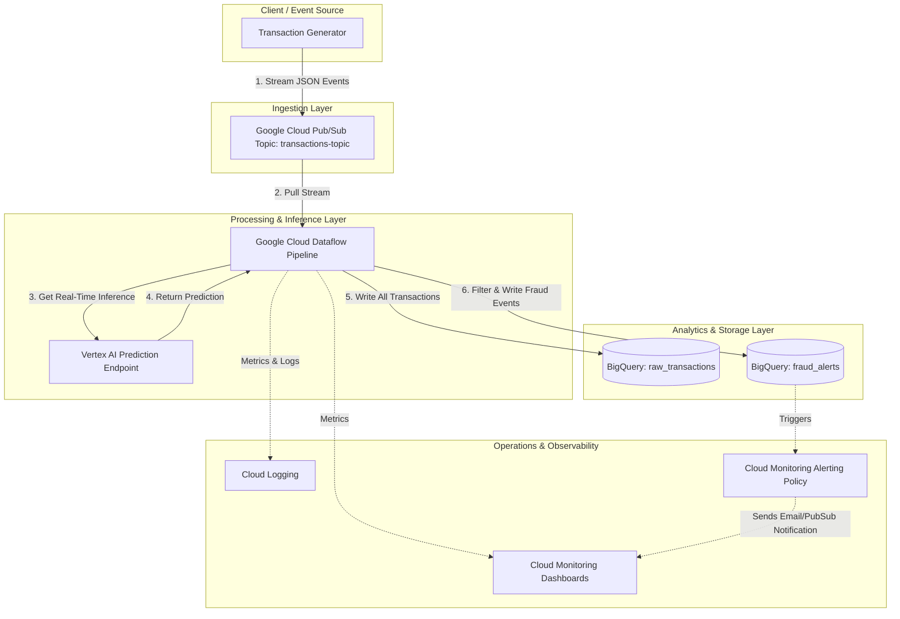

# Architecture Design: Real-Time Fraud Detection Streaming Platform

This document details the production-grade, streaming machine learning system architecture for real-time credit card fraud detection on Google Cloud Platform (GCP).

---

## 1. System Architecture Overview

The system processes transaction events in real time as they occur. The data flow moves from ingestion to stream processing, feature engineering, real-time ML model inference, storage, and alerting.

### Architecture Data Flow Diagram (Mermaid)

---

## 2. GCP Components Deep Dive

As a Professional Machine Learning Engineer (PMLE), understanding *why* a technology is selected, its trade-offs, and how it is applied in production is crucial. Below is the detailed breakdown of each architectural component.

---

### A. Google Cloud Pub/Sub

#### What it is
Google Cloud Pub/Sub (Publish/Subscribe) is an asynchronous, global, serverless messaging service. It decouples senders (publishers) that produce events from receivers (subscribers) that process those events.

#### Why it exists
In modern distributed systems, services must communicate reliably without being tightly bound to one another. Pub/Sub acts as a shock absorber (or message buffer), absorbing massive bursts of transaction spikes and storing them safely until downstream services are ready to process them.

#### Advantages
* **Infinite, Automatic Scaling**: Scales from zero to millions of messages per second with no manual intervention.
* **Low Latency**: Delivers messages globally with sub-millisecond latencies.
* **Durability & Reliability**: Replicates data across multiple zones and guarantees at least-once delivery.
* **Loose Decoupling**: Publishers don't need to know who the subscribers are or if they are currently online.

#### Disadvantages
* **Out-of-Order Delivery**: Standard Pub/Sub topics do not guarantee strict message ordering (though ordering keys can be used with a performance penalty).
* **At-Least-Once Delivery**: Downstream applications must be designed to handle duplicate messages (idempotent processing).
* **Cost at Scale**: Can become expensive for very high volume, low-value data compared to self-managed Apache Kafka.

#### Real-World Usage
In financial tech, Pub/Sub is used to ingest swipe events from millions of point-of-sale (POS) terminals worldwide, passing them instantly to fraud analysis systems and database logs.

---

### B. Google Cloud Dataflow (Apache Beam)

#### What it is
Google Cloud Dataflow is a fully managed, serverless execution service for running Apache Beam pipelines. Apache Beam is an open-source, unified programming model for defining both batch and streaming data processing pipelines.

#### Why it exists
Processing data in real time (streaming) requires managing complex logic: sliding windows of time, out-of-order data, and scaling infrastructure automatically. Dataflow abstracts away all infrastructure provisioning, cluster tuning, and scaling, letting developers focus solely on writing the pipeline logic.

#### Advantages
* **Unified Model**: Same code works for both batch (historical) and streaming (real-time) data.
* **Auto-Scaling & Dynamic Work Rebalancing**: Automatically scales up or down based on throughput and CPU utilization.
* **Exactly-Once Processing**: Guarantees that each event is processed exactly once downstream, avoiding duplicate transactions.
* **Stateful Processing**: Easily tracks state across windows (e.g., "calculate the sum of transactions for a user in the last 10 minutes").

#### Disadvantages
* **Vendor Lock-In**: While Apache Beam is open source, running it optimally on Dataflow requires using GCP-specific components.
* **Development Complexity**: Writing Apache Beam pipelines has a steep learning curve.
* **High Startup Latency**: Deploying or updating a pipeline takes several minutes to provision VMs.

#### Real-World Usage
Used by ride-sharing companies to compute real-time surge pricing by processing location streams, or by banks to aggregate customer transaction histories over sliding windows for fraud check algorithms.

---

### C. Vertex AI Prediction Endpoints

#### What it is
Vertex AI is GCP's unified machine learning platform. A Vertex AI Endpoint is a fully managed, auto-scaling web service that hosts a trained ML model and exposes an API endpoint for real-time predictions.

#### Why it exists
Getting a machine learning model from a Jupyter Notebook into a secure, scalable, and high-performance production API is historically difficult. Vertex AI Endpoints automate deployment, load balancing, logging, and auto-scaling of prediction APIs.

#### Advantages
* **Fully Managed & Auto-scaling**: Scales the number of compute instances up or down based on incoming request traffic.
* **Integrated Monitoring**: Built-in support for model monitoring (detecting feature drift and concept drift).
* **Framework Agnostic**: Supports custom containers, pre-built containers (XGBoost, TensorFlow, PyTorch), and AutoML.
* **Low Latency**: Optimized hosting reduces latency overhead for real-time inference.

#### Disadvantages
* **Cold Starts**: If scaled to zero, the first request may experience latency while a new instance spins up.
* **Cost**: Managed compute resources are more expensive than hosting raw models on Google Kubernetes Engine (GKE) or Cloud Run if custom container setups are highly optimized.

#### Real-World Usage
An e-commerce site uses Vertex AI Endpoints to serve real-time recommendations to users as they browse products, serving hundreds of queries per second (QPS).

---

### D. Google Cloud BigQuery

#### What it is
BigQuery is a serverless, highly scalable, and cost-effective multi-cloud data warehouse designed for business intelligence and analytics.

#### Why it exists
Analyzing petabytes of data using traditional relational databases (like PostgreSQL or MySQL) is slow and expensive. BigQuery uses a columnar storage architecture and massive parallel processing (MPP) to query gigabytes to petabytes of data in seconds using standard SQL.

#### Advantages
* **Serverless**: No database instances to provision, configure, or manage.
* **Performance**: Columnar storage and parallel execution make queries incredibly fast.
* **Rich ML Integrations**: BigQuery ML (BQML) allows training and running models directly inside the warehouse using SQL.
* **Streaming Ingest**: Supports high-throughput streaming inserts directly into tables.

#### Disadvantages
* **No Primary/Foreign Keys Enforcement**: Relies on application logic to enforce constraints (though primary keys can be declared metadata-only).
* **Not for OLTP**: It is a data warehouse (OLAP), not a transactional database. It should not be used for backend application state or frequent single-row updates/deletes.
* **Query Cost**: Cost is based on the volume of data scanned by queries, which can spike if queries are poorly optimized (e.g., using `SELECT *`).

#### Real-World Usage
Data analysts use BigQuery to run monthly reports on credit card transaction volume, train offline machine learning models for user churn prediction, and audit historical fraud alerts.

---

### E. Terraform

#### What it is
Terraform by HashiCorp is an open-source Infrastructure as Code (IaC) tool. It allows developers to define cloud infrastructure in declarative configuration files (HashiCorp Configuration Language or HCL) and manage its lifecycle.

#### Why it exists
Manually clicking through the GCP Console to create Pub/Sub topics, BigQuery datasets, and Dataflow jobs is error-prone, hard to audit, and impossible to reproduce across dev, staging, and production environments. Terraform ensures that infrastructure is version-controlled, reproducible, and documented.

#### Advantages
* **Infrastructure as Code**: Infrastructure is documented, version-controlled, and code-reviewed.
* **State Management**: Keeps track of the real state of resources in a state file (`.tfstate`), ensuring exact alignment with the cloud provider.
* **Idempotent**: Re-running `terraform apply` only makes changes if the configuration differs from the deployed state.
* **Multi-Cloud**: Supports GCP, AWS, Azure, and hundreds of other providers.

#### Disadvantages
* **State Sync Issues**: If resources are changed manually in the GCP console, the Terraform state becomes out of sync ("configuration drift").
* **Risk of Destructive Changes**: A small typo can cause Terraform to delete and recreate a production database.

#### Real-World Usage
Platform and DevOps engineers use Terraform to provision identical dev, staging, and production environments with a single command, ensuring no environment drift.

---

### F. Cloud Monitoring & Cloud Logging (Observability)

#### What it is
* **Cloud Logging**: A fully managed service that stores, searches, analyzes, and alerts on log data.
* **Cloud Monitoring**: A service that monitors system performance, uptime, and overall health via metrics, dashboards, and alerts.

#### Why it exists
In a distributed streaming architecture, failure can happen anywhere (e.g., Dataflow pipeline runs out of memory, Vertex AI prediction endpoint times out, Pub/Sub queue builds up latency). Without centralized logging and monitoring, debugging issues in real time is impossible.

#### Advantages
* **Out-of-the-Box GCP Integration**: Automatically collects logs and metrics from Dataflow, Pub/Sub, Vertex AI, and BigQuery.
* **Real-time Alerting**: Sends notifications (email, Slack, SMS) when critical metrics cross thresholds.
* **Powerful Querying**: Log Explorer allows filtering logs using a structured query language.

#### Disadvantages
* **Log Volume Cost**: Generating too many verbose debug logs in production can lead to high storage costs.
* **Alert Fatigue**: Poorly configured alerts can spam engineers, leading to real issues being ignored.

#### Real-World Usage
Operations teams use Cloud Monitoring dashboards to monitor the consumer lag of the Pub/Sub subscription. If the backlog increases, it triggers an alert indicating the Dataflow pipeline is struggling to keep up.

---

## 3. Design Decisions & Trade-offs

Here are the key engineering design decisions made for this architecture and their rationale:

| Decision | Choice | Alternatives Considered | Rationale |
| :--- | :--- | :--- | :--- |
| **Ingestion Engine** | **Cloud Pub/Sub** | Apache Kafka / Cloud Pub/Sub Lite | Standard Pub/Sub requires zero server management and scales instantly, making it ideal for a serverless, portfolio-grade GCP architecture. Kafka requires high management overhead; Pub/Sub Lite requires partition provisioning. |
| **Inference Strategy** | **Online RPC (Dataflow calling Vertex AI Endpoint)** | Embedded Model (Dataflow loading model file) | Calling a Vertex AI Endpoint keeps the model and pipeline decoupled. The model can be updated or rolled back without redeploying the Dataflow streaming pipeline. The drawback is the network overhead per request, which we will mitigate using batching and caching. |
| **Data Storage** | **BigQuery** | Cloud Spanner / Cloud Bigtable | BigQuery serves as an excellent analytics engine where ML engineers can query historical data, perform feature analysis, and build dashboards. Since we don't need sub-millisecond lookups for historical queries in our transaction system, BigQuery is more cost-effective than Spanner. |
| **IaC Management** | **Terraform with GCS Backend** | Pulumi / Cloud Config / Manual console | GCS backend ensures state is persisted securely in a bucket rather than locally. This represents a production-grade infrastructure deployment practice. |

---

## 4. Professional Machine Learning Engineer (PMLE) Relevance

During a PMLE interview, you will be evaluated on your ability to design robust, production-grade systems. Here is how the Day 1 architecture map relates to PMLE Certification criteria:

1. **Designing ML Pipelines (Section 1 of PMLE Exam)**: Designing an end-to-end streaming data pipeline that feeds data to a Vertex AI model is a core competency.
2. **Serving Models (Section 4 of PMLE Exam)**: Knowing the trade-offs of online prediction endpoints vs. batch prediction vs. edge model serving is a heavily tested topic.
3. **MLOps & Observability (Section 5 of PMLE Exam)**: Monitoring prediction latency, throughput, error rates, and model performance is essential to prevent silent failures in production ML systems.

---

## 5. PMLE Mentor Interview Prep Questions

Prepare answers to these system design questions based on this architecture:

### Q1: Why did we choose Dataflow to invoke the Vertex AI endpoint rather than having the client call the endpoint directly?
* **Answer**: Decoupling the client from the ML model is a best practice. The client only needs to publish a simple transaction event. The Dataflow streaming pipeline is responsible for orchestrating the event: executing real-time feature transformations (aggregating history), calling the prediction endpoint, writing results to multiple destinations, and handling retries if the model endpoint is temporarily unavailable. If the client called the endpoint directly, any network failure or model downtime could cause transaction failures on the client side.

### Q2: What happens if the Vertex AI Endpoint experiences a sudden traffic spike and starts returning HTTP 429 (Too Many Requests)? How does this architecture handle it?
* **Answer**: We handle this in the Dataflow pipeline. In Apache Beam, when calling external services like Vertex AI, we use resilient client libraries with exponential backoff and retry policies. Because Pub/Sub buffers the incoming transaction events, if Dataflow slows down due to Vertex AI rate limits, the messages simply queue up safely in the Pub/Sub topic without loss. Once the rate limits subside, Dataflow drains the backlog.

### Q3: When should you use an embedded model inside Dataflow (e.g., loading a SavedModel in the Beam worker) versus making an RPC call to a Vertex AI Endpoint?
* **Answer**: 
  * **Use Embedded Model** when ultra-low latency is required (sub-5ms) and the model is lightweight. Loading the model directly on Beam workers avoids network latency and API costs.
  * **Use Vertex AI Endpoint** when you need to update/redeploy the model frequently without redeploying the Dataflow pipeline. It also allows separate scaling of prediction servers and streaming workers, provides built-in model versioning, monitoring, and keeps memory footprints on Dataflow workers low.
